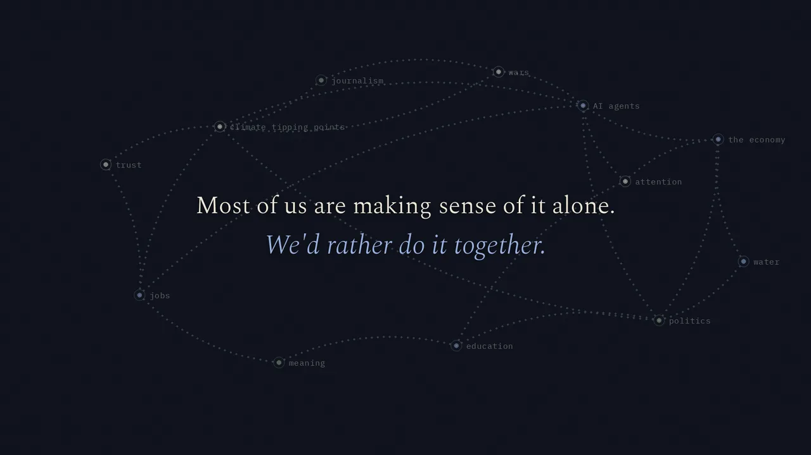
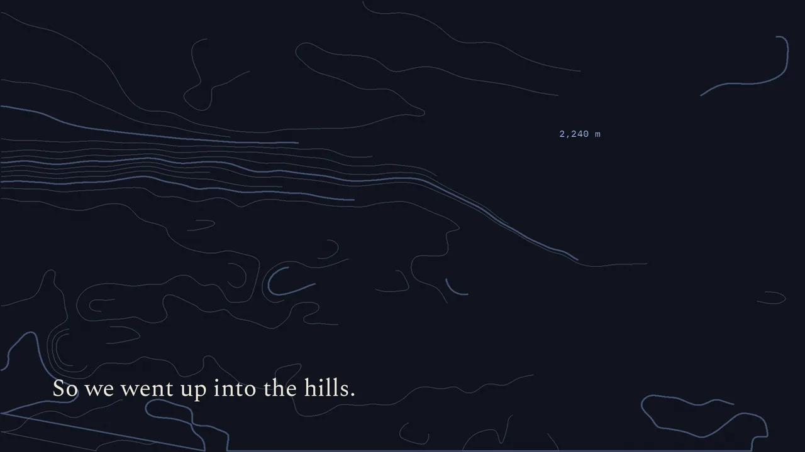
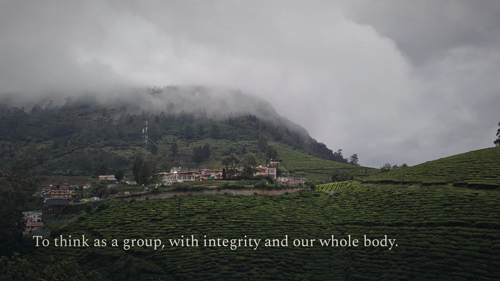
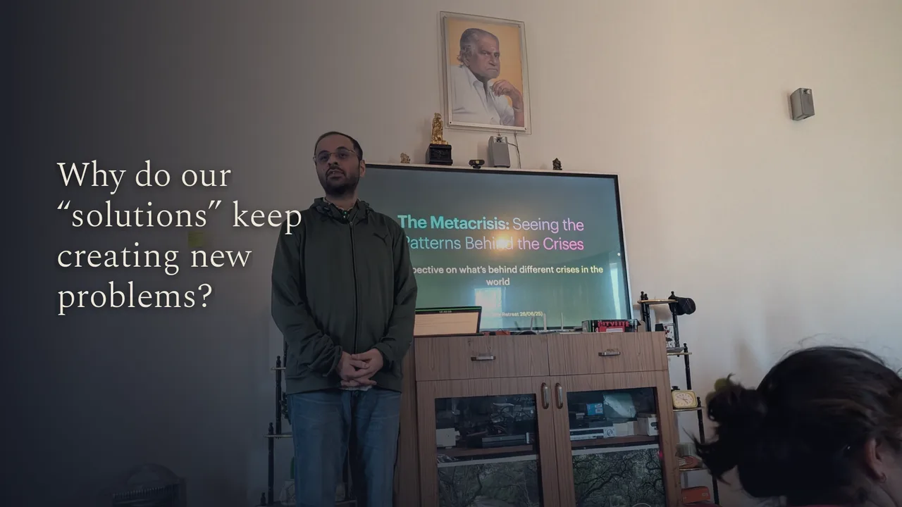
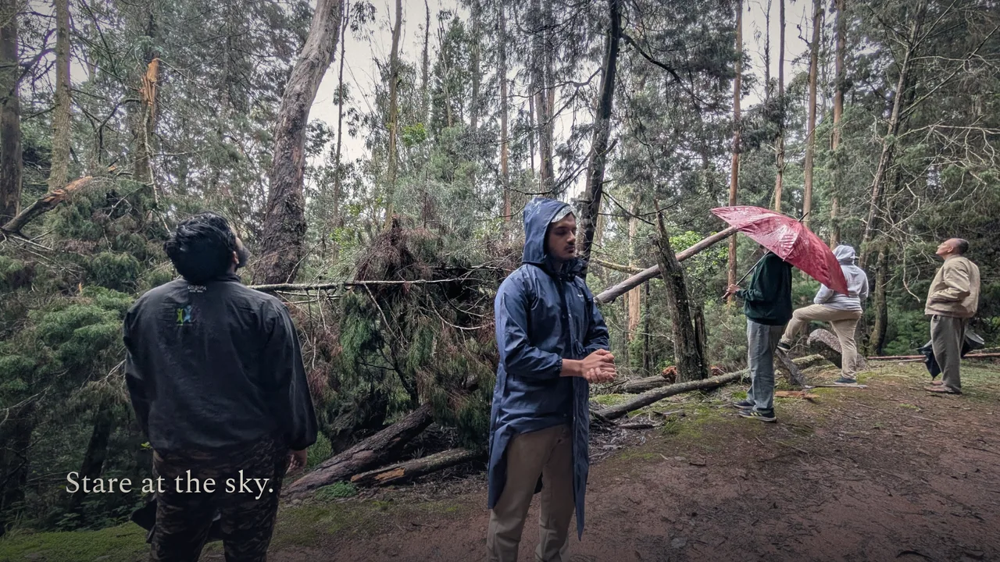
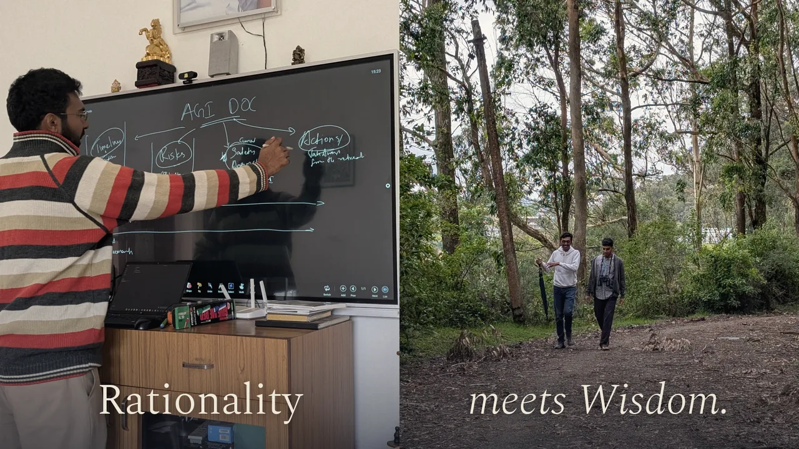
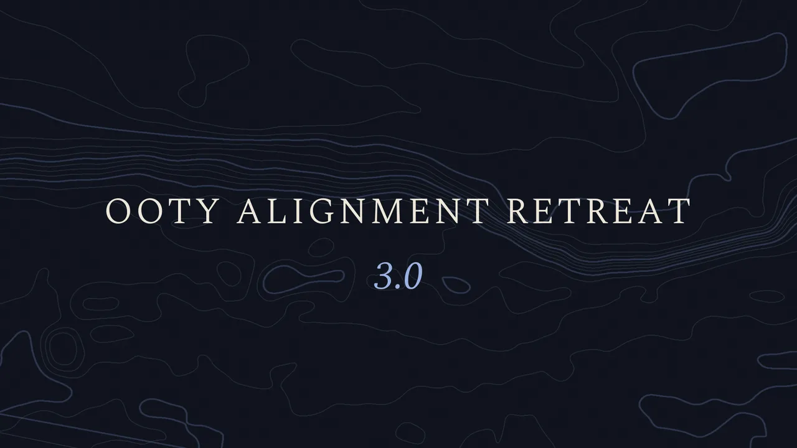
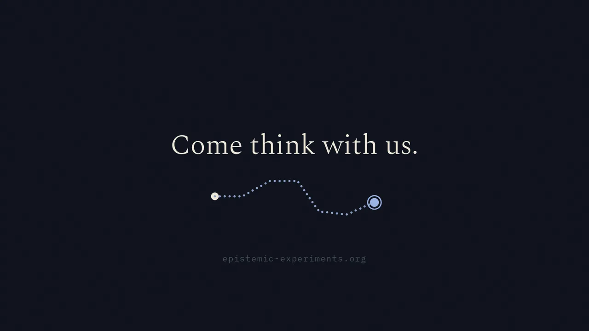
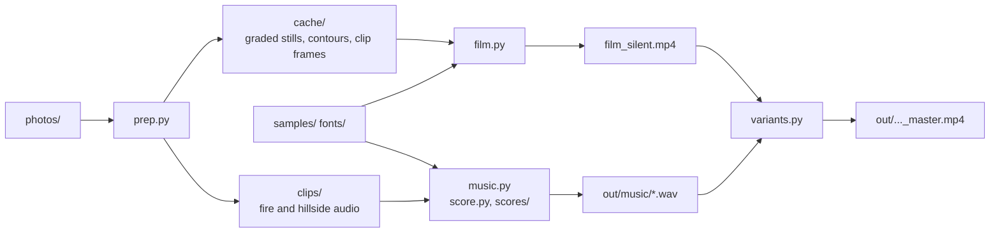

# epistemic-movie-gen

Short films for Epistemic Experiments, made entirely in code. Python draws every frame from a set of
photos and composes the score from free orchestral samples. ffmpeg turns both into the video.

The first film is the 2:29 promo for Ooty Alignment Retreat 3.0. The scenes, text and photo choices
in `film.py` and `prep.py` belong to that film. The renderer, the music engine and the scores work
for any film.

| | |
|---|---|
|  |  |
|  |  |
|  |  |
|  |  |

## How it fits together



- `prep.py` grades the photos and draws the contour maps once, into `cache/`.
- `film.py` draws every frame and encodes the picture. `look.py` holds the palette and paper texture.
- `score.py` is the music engine and the film's own score. `music.py` renders it and the alternative
  scores in `scores/`. The sound side has its own README: [scores/README.md](scores/README.md).
- `variants.py` joins a picture and a soundtrack into a master.
- Picture and music share one clock: 72 beats a minute, four beats a bar. Every cut and line of text
  lands on a beat of the score.

## Reproduce the film

You need macOS on Apple Silicon for the fast renderer. Other systems work, but render slower. You
also need Python 3 (tested on 3.14), ffmpeg, and about 2 GB of free disk.

1. Install ffmpeg: `brew install ffmpeg`.
2. Create the environment:
   ```sh
   python3 -m venv .venv
   .venv/bin/pip install -r requirements.txt
   ```
3. Download the samples, fonts and face model (about 1.5 GB): `.venv/bin/python fetch_assets.py`.
4. Put the retreat photos in `photos/`. Ask an organiser for the archives, then unzip:
   ```
   photos/retreat1/   Photos-ooty-1.zip   (Retreat 1.0, June 2024)
   photos/retreat2/   Photos-ooty-2.zip   (Retreat 2.0, June 2025, with the three .MP4 clips)
   photos/extra/      Photos-1-001-ooty2-extra (the metacrisis talk)
   ```
5. Prepare the stills and clips: `.venv/bin/python prep.py` (about 10 s).
6. Render the gentle score: `.venv/bin/python music.py gentle` (about 10 s).
7. Render the picture and the master:
   ```sh
   .venv/bin/python variants.py v4.6 dark --music out/music/gentle.wav
   ```

The master lands in `out/ooty_retreat_3.0_v4.6_dark_master.mp4`. On an M5 Pro the picture takes
about 80 s.

To check one frame without a full render: `.venv/bin/python film.py stills 30.5 72`. It saves a
JPEG for each time in seconds.

## Switches

Set these as environment variables before a command.

| Variable | Values | Effect |
|---|---|---|
| `PAGE` | `dark` (default), `light` | Night-ink or paper pages for the text and drawing scenes |
| `STYLE` | `bleed` (default), `clean`, `night` | How the question screens show their photos |
| `BLUR` | `0` (default), `1` | Blur faces in the stills. Rerun `prep.py` after you change it |
| `GENTLE` / `QUIET` / `ARR` | see [scores/README.md](scores/README.md) | Versions of the score |
| `PHOTOS` | a path (default `photos/`) | Where `prep.py` finds the retreat photos |
| `OUT` | a path (default `out/`) | Where masters and music go |

`python variants.py v4.6 dark light` renders both looks. For the extras, first render the
`orchestral` and `quiet` scores with `music.py`. `python variants.py v4.6 --extras` then makes a
share-size copy, a quiet-score copy and a 63 s teaser from existing renders.

## The renderer

`film.py` cuts the timeline into 3 s chunks and gives them to six worker processes. Each worker
draws its frames and feeds its own encoder. ffmpeg then joins the chunks without encoding again.
On a Mac the encoder is the hardware HEVC encoder. Elsewhere it falls back to software x264.

The opening world map is the expensive scene, at about 190 ms a frame. A photo frame takes about
20 ms. Small chunks spread that load evenly. `bench.py` and `bench_run.py` time the encoders and
schedules on a 10 s clip.

## Files

| File | Holds |
|---|---|
| `film.py` | Every scene, the shot lists, the text, the renderer |
| `look.py` | Palette, paper texture, fonts, the photo plates |
| `prep.py` | Which photo goes where, the grade, contour extraction, clip frames and audio |
| `faces.py` | Face detection and blur (YuNet), off by default |
| `score.py` | The music engine and the film's score |
| `music.py` | Renders any soundtrack by name |
| `scores/` | Alternative scores and their shared helpers |
| `variants.py` | Picture plus soundtrack into masters, share copies and the teaser |
| `fetch_assets.py` | Downloads samples, fonts and the face model |
| `data/` | The sample list and the organ's pitch table |

## Credits and licences

- Instrument samples: [VSCO 2 Community Edition](https://versilian-studios.com/vsco-community/),
  CC0. The organ is by Simon Dalzell of Ivy Audio.
- Fonts: Spectral and IBM Plex Mono, SIL Open Font License.
- Face detection: [YuNet](https://github.com/opencv/opencv_zoo/tree/main/models/face_detection_yunet)
  from the OpenCV model zoo.
- The retreat photos and clips belong to the participants. They stay out of this repo.
